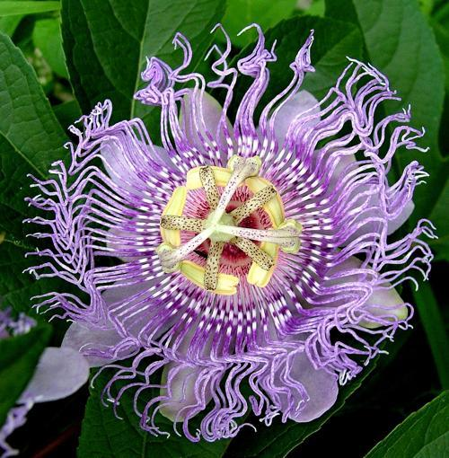

# flower-classifier

 [](https://share.streamlit.io/jeremyjordan/flower-classifier/app.py)

*Authors: Jeremy Jordan and John Huffman*

John and I were walking through a garden one day and kept pointing out flowers that we thought looked cool. The only problem was... we didn't know the names of any of the flowers! As machine learning engineers, our first thought was "let's build an image classifier" and this project was born. 



## Getting started

1. Spin up a [Colab notebook](https://colab.research.google.com/).
2. Install [colabcode](https://github.com/abhishekkrthakur/colabcode).
3. Start the code server.

```
from colabcode import ColabCode
ColabCode(port=10000, mount_drive=True)
```
4. Go to the ngrok link provided.
5. Clone the repo.

```
git clone https://github.com/jeremyjordan/flower-classifier.git
```

6. Run `make colab` to set up the project on your Colab instance (or run `make init` if running locally).
7. Start a training job by running `train`, optionally providing configuration options.
    - eg. If you want to do a quick check, you can run `train trainer=smoke_test`


## Contributing

In order to commit code from a Colab machine, you'll need to do the following:

1. Make sure you have an Github auth token (https://github.com/settings/tokens)
2. Configure the `git` settings on the machine
```
git config --global user.name "Jeremy Jordan"
git config --global user.email ""
gh auth login --with-token <<< INSERT_TOKEN_HERE
```

Note: make sure you've ran `make colab` before setting this up.